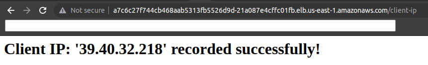

# IP-Recorder Application using EKS/RDS

A Simple Python flask server that implements two endpoints.

- `/client-ip` Records Public IP of the user and store it in the RDS database
- `/client-ip/list` Queries the RDS database and displays on a table

## Pre-requisites
- `terraform`
- `terragrunt`
- `awscli`
- `eksctl`
- `jq`
- `helm`
- `docker`
- `docker-compose`
- `make`

## Quick Start

### Bring UP infra
```
make infra-up
```

### Find ECR URL and replace in Makefile
```
cd terragrunt/infra/ecr; terragrunt output repository_url
```

### Build and Push the image
```
make build-push
```

### Export KUBECONFIG

```
export KUBECONFIG=$HOME/.kube/eksctl/clusters/<name>
```

### Update values in chart/ip-recorder/values.yaml file
```
# e.g. 1. image.repository
#      2. image.tag
#      3. env.DB_HOST
#      4. env.DB_PORT
#      5. env.DB_PASSWORD (Secret will be created in the next steps )
#      6. ingress.className (should be "nginx")
#      6. ingress.hosts.host (kubectl get svc ingress-nginx-controller -n nginx-ingress -ojson | jq -r .status.loadBalancer.ingress[0].hostname)
```

### Deploy Application
```
make manifests
make apply
```

### Find RDS Instance Password and create db-password
```
PASSWORD=$(cd terragrunt/infra/rds; terragrunt output db_instance_password | jq -r )
kubectl create secret generic db-password --from-literal=password=$PASSWORD -n <NAMESPACE>
```

### Record IP 
```
HOSTNAME=$(kubectl get svc ingress-nginx-controller -n nginx-ingress -ojson | jq -r .status.loadBalancer.ingress[0].hostname)
curl http://$HOSTNAME/client-ip
```
### List IPs 

```

curl http://$HOSTNAME/client-ip/list
```
### Browser /client-ip Endpoint

### Browser /client-ip/list Endpoint


## Directory Structure

`deployments/chart` contains Helm chart for ip-recorder app
`deployments/all-in-one` contains single file templated from the helm chart for easy apply
`terragrunt/`  
`terragrunt/modules` contains Infrastructure modules referenced to <https://registry.terraform.io>
`terragrunt/infra` contains inputs for modules and env related values


```
.
├── deployments
│   ├── all-in-one
│   │   └── ip-recorder.yaml
│   └── chart
│       └── ip-recorder
│           ├── charts
│           ├── Chart.yaml
│           ├── templates
│           │   ├── deployment.yaml
│           │   ├── _helpers.tpl
│           │   ├── hpa.yaml
│           │   ├── ingress.yaml
│           │   ├── NOTES.txt
│           │   ├── serviceaccount.yaml
│           │   └── service.yaml
│           └── values.yaml
├── docker-compose.yml
├── Dockerfile
├── gunicorn.sh
├── html
│   └── list.html
├── main.py
├── Makefile
├── README.md
├── requirements.txt
└── terragrunt
    ├── infra
    │   ├── aws-lb-controller
    │   │   └── terragrunt.hcl
    │   ├── backend.tf
    │   ├── ecr
    │   │   └── terragrunt.hcl
    │   ├── eks
    │   │   ├── script.sh
    │   │   └── terragrunt.hcl
    │   ├── nginx-ingress
    │   │   ├── backend.tf
    │   │   ├── helm-chart.tf
    │   │   ├── provider.tf
    │   │   ├── terragrunt.hcl
    │   │   └── values.yaml
    │   ├── provider.tf
    │   ├── rds
    │   │   └── terragrunt.hcl
    │   ├── terragrunt.hcl
    │   └── vpc
    │       └── terragrunt.hcl
    └── modules
        ├── aws-lb-controller
        │   ├── terragrunt.hcl
        │   └── variables.tf
        ├── ecr
        │   └── terragrunt.hcl
        ├── eks
        │   └── terragrunt.hcl
        ├── rds
        │   └── terragrunt.hcl
        └── vpc
            └── terragrunt.hcl
```
## Infrastructure Details

### Build Up Everything

The following command will create
- 1x VPC (2x Private, 2x Public subnets in`us-east-1` region)
- 1x EKS (1xNodeGroup)
- 1x RDS (MySQL instance)
- 1x ECR reository
- AWS Load Balancer Deployment in EKS
- Nginx Ingress Deployment in EKS

```
make infra-up
```

### Tear Down

```
make infra-down
```

## Running Locally

```
make run
```

## TODOS:
- Separate out ECR/RDS/EKS IAMs and Roles and use them appropriately. Now access for only `terraform-user`.
- Make separate Admin group with IAM users and separate RBAC for EKS Admins and EKS Users
- Include Architecture Diagram
- Use `terragrunt/dev/`,`terragrunt/prod/`,`terragrunt/qa/` etc. dirs instead of `terragrunt/infra` for environment specific dirs.